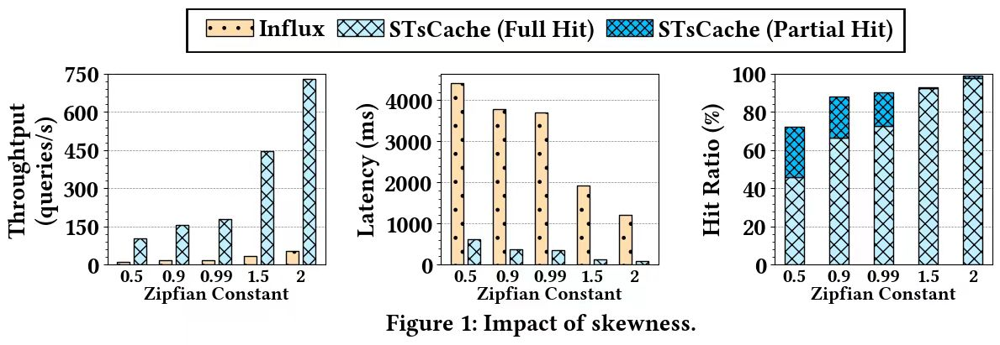
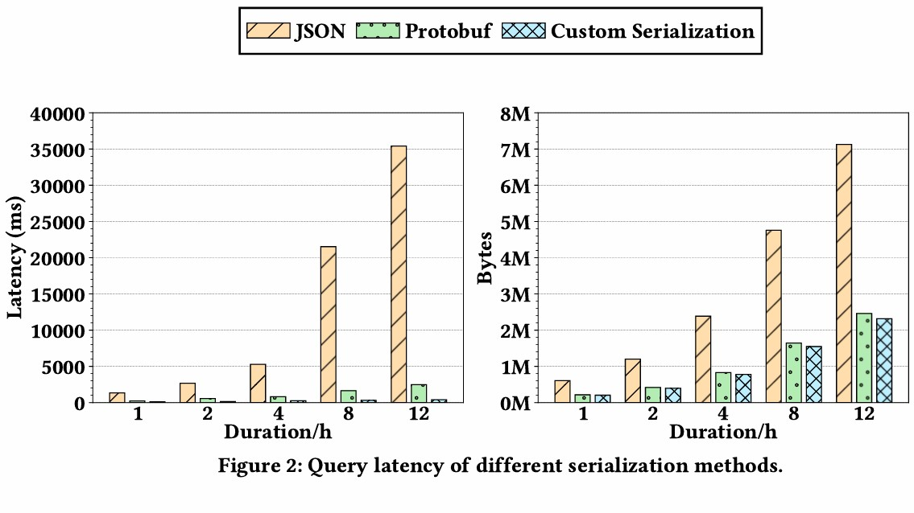

# Experiment  

## Impact of Skewness

In our experiments, the Zipfian Constant was set to 0.99, which is the default value. To explore the  system performance under different skewness of the workload, we conducted experiments with  Zipfian Constants set to 0.5, 0.9, 0.99, 1.5, and 2. Figure 1 illustrates the impact of workload  skewness on system performance. The performance of InfluxDB and STsCache improves with the  increase of workload skewness, particularly STsCache. In highly skewed workloads, STsCache  optimizes query efficiency by retaining hot data to quickly respond to new queries.

## Different serialization methods

We have also compared the performance of STsCache by varying the serialization methods, including our custom one, Protobuf and JSON. The workload consisted of querying the 𝑐𝑝𝑢_𝑢𝑠𝑎𝑔𝑒 field of ten hosts in the DevOps use case, with query durations of 1 hour, 12 hours, and 24 hours. We pre-warmed the data in STsCache to ensure all queries resulted in full hits, thereby more clearly observing the impact of different serialization methods on end-to-end query performance. Additionally, we also compared the effect of the size of the serialized data. As shown in Figure 2, the latency of STsCache using the custom serialization method is lower than that of Protobuf by 45.7%-83.9% and lower than that of JSON by 90.7%-98.9%. In terms of serialized data size, custom serialization produces data that is 5.4%-7.1% smaller than Protobuf and 66.5%-67.5% smaller than JSON. The benefits of custom serialization become more significant as the query data volume increases.